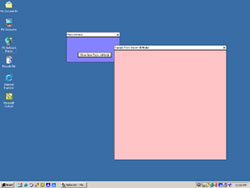



## Borderless Forms

### Description

This is an example of creating borderless forms. It will help you create your own look for your application, if you would like to move away from the typical Microsoft Standard.
 
### More Info
 
Only the contols have to be copied to a new form and then the code is all in the module just place it in the approriate places. I wanted to write a control to do this but I ran into many problems passing parameters. If anyone wants a shot at it enjoy and let me know if it works.

This code should work in all version of Microsoft Windows from any 9x to 2000 versions. Resoultion may be any issue of the forms are created to large. Besides that, none that I am aware of.

             |
---                |---
**Submitted On**   |2001-11-13 12:01:26
**By**             |[iPhatmaN](https://github.com/Planet-Source-Code/PSCIndex/blob/master/ByAuthor/iphatman.md)
**Level**          |Intermediate
**User Rating**    |4.7 (14 globes from 3 users)
**Compatibility**  |VB 6\.0
**Category**       |[Custom Controls/ Forms/  Menus](https://github.com/Planet-Source-Code/PSCIndex/blob/master/ByCategory/custom-controls-forms-menus__1-4.md)
**World**          |[Visual Basic](https://github.com/Planet-Source-Code/PSCIndex/blob/master/ByWorld/visual-basic.md)
**Archive File**   |[Borderless3507411132001\.zip](https://github.com/Planet-Source-Code/iphatman-borderless-forms__1-28872/archive/master.zip)

